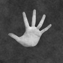
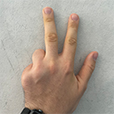
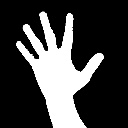
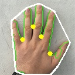
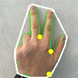
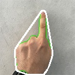
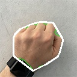
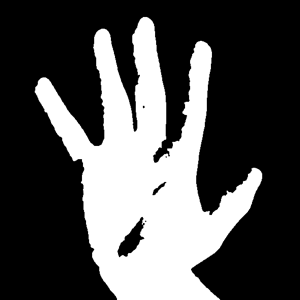
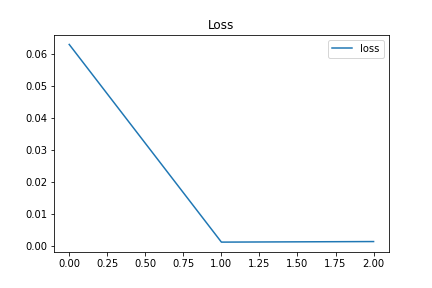
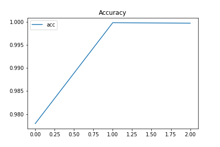

# Computer Vision - Finger Counter for Human-Computer Interactions <!-- omit in toc -->


## Inhaltsverzeichnis <!-- omit in toc -->

- [Projektbeschreibung](#projektbeschreibung)
  - [Ansätze](#ansätze)
  - [Minimal Viable Product (MVP)](#minimal-viable-product-mvp)
  - [Umsetzung und Projektverlauf](#umsetzung-und-projektverlauf)
    - [Datensätze](#datensätze)
    - [**Convex-Hull**](#convex-hull)
    - [**ML**](#ml)
  - [Fazit](#fazit)
    - [**Weitere Ansätze und Ausblick**](#weitere-ansätze-und-ausblick)

## Projektbeschreibung

Ziel des Projektes, war die Implementierung einer berührungslosen Handgestensteuerung für eine Website oder Anwendung.

### Ansätze

Grundsätzlich sollten Python und OpenCV verwendet werden. Eine Livekamera sollte die hochgehaltenen Hände aufzeichnen. Das zählen der Finger sollte durch folgende Ansätze realisiert werden:

- ML-Ansatz mit einem CNN (Umsetzung mit Keras
 und TensorFlow)
- Convex-Hull-Algorithmus

Den Fingerzahlen von 0 bis 5 sollten verschiedenen Aktionen zugeordnet werden. Beispielhaft wurde hierfür die Hauptnavigation auf [https://www.beuth-hochschule.de/]() verwendet. Jede Fingeranzahl repräsentiert einen Menüpunkt, wie in dem oberen Demo-Gif gezeigt.

### Minimal Viable Product (MVP)

Für den erfolgreichen Abschluss des Projektes wurden folgende Mindestanforderungen gesetzt:

- Das Zählen der Finger von einer Hand wurde mit beiden Ansätzen umgesetzt und dokumentiert.
- Eine Live-Demo wurde mit dem besser funktionieren Ansatz erstellt.
- Die Live-Demo funktioniert zuverlässig (Die richtige Anzahl der Finger sollte in einem Durchlauf, in dem alle möglichen Handzeichen getestet werden, immer richtig erkannt werden)

### Umsetzung und Projektverlauf

Umgesetzt wurde das Projekt in folgender Entwicklungsumgebung:

- [macOS Big Sur 11.4](https://www.apple.com/macos/big-sur/)
- [Python 3.9](https://www.python.org/)
  - [Keras](https://keras.io/)
  - [TensorFlow](https://www.tensorflow.org/)
  - [Jupyter](https://jupyter.org/)
  - [OpenCV](https://opencv.org/)
  - [Numpy](https://numpy.org/)

#### Datensätze

Als Trainings und Testdaten sollte der Datensatz "fingers" von "koryakinp" verwendet werden. Im finalen Projekt wird davon jedoch aufgrund bestimmter Schwierigkeiten abgesehen, welche in der Sektion [ML](#ml) erläutert werden.

- Link: [https://www.kaggle.com/koryakinp/fingers]()
- 3600 Testdaten
- 18000 Trainingsdaten


  
---

Zum Testen von dem Convex-Hull-Algorithmus wurde ein kleiner Datensatz erstellt. Auf 12 Bildern wurden die gleichen Hände aufgenommen, welche unterschiedlich viele Finger hochhalten.

- Link: [https://www.kaggle.com/devmarcstorm/hands-128]()
  - Oder in diesem Repo: [data/hands_128]()
- 12 Testdaten



---

Als Ersatz für "fingers" wurde ein eigener Datensatz erstellt und auf Kaggle veröffentlicht. *Während der internen Projektpräsentation wurde noch auf "fingers" trainiert.*

- Link: [https://www.kaggle.com/devmarcstorm/fingers-binary-thresh]()
- 4200 Testdaten
- 21154 Trainingsdaten
  - 3022 Bilder pro 0 - 6 (6 := Keine Hand im Bild)



#### **Convex-Hull**

Daher wurde ein eigener Datensatz erstellt, dessen Bilder über die gleiche Methode wie die Live-Anwendung generiert wurden. Der erstellte Datensatz [https://www.kaggle.com/devmarcstorm/fingers-binary-thresh]() hat jeweils 3022 Bilder für 0–5 Finger sowie 3022 Bilder ohne Hand im Bild (6).

Dieser Algorithmus wurde wegen seines ungewöhnlichen Ansatzes gewählt. Anstatt die Finger zu zählen, wird eine konvexe Hülle (weiß) um die Hand herum gezeichnet und die stärksten Abweichungen (Defekte gelb) von der Handkontur zu dieser Hülle gezählt. Dadurch werden nicht die Finger, sondern die Abstände zwischen den Fingern gezählt.



Ein Problem mit dieser Methode ist die Kontur der Hand (grün) richtig zu erkennen. In dem Notebook mit der Implementierung wurde hierfür die Hand mittels der Hautfarbe extrahiert. Da Menschen stark unterschiedliche Hautfarben haben und auch Lichteffekte diese beeinflussen, funktioniert das gesetzte Farbspektrum nur bei den Testbildern und ist mit einem Livebild nicht umzusetzen.

*Dies ist kein Problem mit dem Algorithmus. Der ML-Ansatz zeigt eine alternative Extraktion der Hand, die hier auch angewendet werden könnte.*

Eine weitere Fehlerquelle war eine zu grobe Kontur wie in der nächsten Abbildung gezeigt. Dadurch traten ungewollte Defekte auf. Eine Glättung der Kontur mit `cv2.blur()`löste dieses Problem.



Aufgrund der Tatsache, dass die Fingerzwischenräume und nicht die Finger gezählt werden, kann diese Methode auch nicht zwischen keinem und einem Finger unterscheiden.





Auf den Testbildern war diese Methode außer der genannten Fehler durchweg erfolgreich. Die Implementierung + Erklärung ist in dem Notebook [convex-hull-hand-gesture-recognition.ipynb]() zu finden.

*Verbesserungsforschläge im Kapitel [Weitere Ansätze und Ausblick](#weitere-ansätze-und-ausblick).*

#### **ML**

Als Methode 2 wurde ein machine-learning-Ansatz gewählt, welcher die Limitierungen der 1. Methode überkommen sollte. 

1. Die Erkennung muss Hautfarbenunabhängig funktionieren.
2. Die Methode muss zwischen 0 bis 5 Fingern unterscheiden können.
3. Im besten Fall sollte auch erkannt werden, dass keine Hand im Bild ist.

Über einen Binary-Threshold auf dem Live-Bild, konnte die Hand extrahiert werden. Dabei erscheint die (original weiße) Wand im Bild schwarz und Hand weiß. Da die Hautfarbe nur dunkler als hellweiß sein muss, funktioniert diese Methode Hautfarbenunabhängig.

```python
_, img = cv2.threshold(img, 0, 255, cv2.THRESH_BINARY + cv2.THRESH_OTSU)
```



*Das implementierte CNN ist in [ml-live-finger-counting.ipynb]() zu finden.*

Um den Datensatz, auf dem das implementierte Modell trainiert wird, anzupassen, wurde der Theshold dynamisch auf die Bilder des Datensatzes beim Einladen angewendet. Nachteil hierbei war, dass die Bilder weiter überprüft wurden und somit nicht sichergestellt war, dass der Threshold die Bilder nicht negativ beeinflusst hat. Trotz guter Akkuratheit auf den Testdaten konnten in der Live-Anwendung nur selten zuverlässig erkannt werden, wie viele Finger real hoch gezeigt wurden. Eventuell auch, da der Datensatz keine Arme zeigt und wegen fehlerhaft manipulierter Bilder durch den Threshold.

Daher wurde ein eigener Datensatz erstellt, dessen Bilder über die gleiche Methode wie die Live-Anwendung generiert wurden. Der erstellte Datensatz [https://www.kaggle.com/devmarcstorm/fingers-binary-thresh]() hat jeweils 3022 Bilder für 0–5 Finger sowie 3022 Bilder ohne Hand im Bild (6).

Ohne Veränderung des Models konnten mit dem neuen Datensatz nahezu perfekte Ergebnisse (Acc > 99,9%) erzielt werden. Auch hatte dieser Datensatz Beispiele für die gezeigte 3 mit Zeige-, Mittel- und Ringfinger sowie mit Daumen, Zeige- und Mittelfinger.

Auch wenn es sicherlich bessere Methoden gibt, konnte durch die Bilder der leeren Hand auch auf Abwesenheit der Hand trainiert werden. Das Model gibt hierfür 6 Finger aus, was für die Live-Anwendung als fehlende Hand (NO) interpretiert wird.





Die aktuelle Live-Demo zeigt diesen Erfolg.


### Fazit

Mit Hilfe von machine learning konnte ein zuverlässiges berührungsloses Human-Computer-Interface implementiert werden. 

Eigene Daten haben dabei erheblich zum Erfolg beigetragen. *Auch wenn es mit viel Arbeit verbunden ist 21000+ sinnvolle Bilder zu generieren.*

Mit Keras und TensorFlow, konnten die Layer des Models einfach definiert und das Model selber ohne viel Aufwand trainiert und getestet werden.

Die Implementierung des ML-Ansatzes ist dabei so einfacher umzusetzen, als der Convex-Hull-Algorithmus.

#### **Weitere Ansätze und Ausblick**

Ein weiterer Ansatz wird auf 
[https://medium.com/analytics-vidhya/finger-count-ai-using-opencv-python-b9090eb68928]() beschrieben. Hierbei wird die Mitte der Hand ermittelt und ein Kreis gezogen, welcher die Hand schneidet. Die Schneidepunkte werden unter Berücksichtigung des Arms gezählt und somit die Finger gezählt. Im Gegensatz zu der Implementierung in der Sektion [convex-hull](#convex-hull) kann diese Methode zwischen 0 und einem Finger unterscheiden. Dies könnte also eine mögliche Methode ohne ML darstellen.


Die Demo des ML-Ansatzes zeigt, dass eine Umsetzung des berührungslosen Human-Computer-Interface möglich ist. Wird die Extraktion der Hand aus einem Bild verbessert, könnte ein Einsatz unter realen Bedingungen möglich sein. Mögliche Anwendungen sind z. B. öffentliche, interaktive Informationstafeln (Vermeidung von Körperkontakten um das Risiko von Infektionen zu verringern) oder Interaktionen mit Augmented-Reality-Brillen.


